# Raport koncowy: ANN vs CNN vs SNN na czterech zbiorach danych

**Autor:** Dominik Godek
**Data:** 10 czerwca 2026

---

## 1. Opis eksperymentu

Porownanie trzech architektur sieci neuronowych na czterech zbiorach danych o ksztalcie 28x28:

- **ANN** -- MLP: Linear(784,128) -> ReLU -> Linear(128,10). Parametry: 101 770 (0.39 MB).
- **CNN** -- Conv2d(1,16,3) -> ReLU -> MaxPool -> Conv2d(16,32,3) -> ReLU -> MaxPool -> FC(128) -> FC(10). Parametry: 206 922 (0.79 MB).
- **SNN** -- SpikingMLP: Linear(784,128) -> LIF(beta=0.95) -> Linear(128,10) -> LIF. Rate coding, 20 timesteps. Parametry: 101 770 (0.39 MB) -- z wyjatkiem Sequential MNIST (5 002 params, 0.02 MB, bo input_size=28).

Ustawienia: 15 epok, batch_size=128, Adam lr=1e-3, powtorzenie na 3 seedach (7, 13, 42). Trening na CPU.

Zbiory danych:
- **MNIST** -- cyfry 0-9, encoding: rate coding.
- **Fashion-MNIST** -- ubrania/buty (10 klas), encoding: rate coding.
- **KMNIST** -- znaki japonskie (10 klas), encoding: rate coding.
- **Sequential MNIST** -- ten sam MNIST, ale obraz podawany wiersz po wierszu (28 krokow czasowych), encoding: sequential.

---

## 2. Wyniki -- tabele zbiorcze

### 2.1 Dokladnosc i F1 (mean +/- std po 3 seedach)

| Dataset | ANN acc | ANN F1 | CNN acc | CNN F1 | SNN acc | SNN F1 |
| --- | ---: | ---: | ---: | ---: | ---: | ---: |
| MNIST | 95.55 +/- 0.57 | 95.45 +/- 0.61 | **98.15 +/- 0.11** | **98.14 +/- 0.11** | 96.35 +/- 0.41 | 96.27 +/- 0.45 |
| Fashion-MNIST | 85.05 +/- 0.67 | 85.13 +/- 0.51 | **87.78 +/- 0.77** | **87.95 +/- 0.63** | 83.43 +/- 0.31 | 83.18 +/- 0.37 |
| KMNIST | 80.80 +/- 1.44 | 80.82 +/- 1.40 | **89.68 +/- 1.14** | **89.68 +/- 1.11** | 82.43 +/- 0.90 | 82.45 +/- 0.82 |
| Seq-MNIST | 95.38 +/- 0.29 | 95.29 +/- 0.32 | **97.75 +/- 0.14** | **97.71 +/- 0.17** | 76.92 +/- 0.95 | 76.03 +/- 1.05 |

**Obserwacja:** CNN wygrywa na kazdym datasecie. SNN przewyzsza ANN tylko na MNIST i KMNIST, natomiast na Fashion-MNIST i Sequential MNIST wypada gorzej.

### 2.2 Czas treningu i zbieznosc

| Dataset | ANN czas [s] | CNN czas [s] | SNN czas [s] | ANN epoka do 90% | CNN epoka do 90% | SNN epoka do 90% |
| --- | ---: | ---: | ---: | ---: | ---: | ---: |
| MNIST | 16.6 +/- 2.6 | 32.1 +/- 8.2 | 77.7 +/- 7.4 | ~1.3 | 1.0 | ~1.3 |
| Fashion-MNIST | 15.1 +/- 1.9 | 24.5 +/- 8.9 | 64.0 +/- 9.6 | -- | -- | -- |
| KMNIST | 19.3 +/- 5.5 | 19.5 +/- 2.6 | 58.7 +/- 1.9 | -- | 10.0 (1/3 seedow) | -- |
| Seq-MNIST | 13.2 +/- 0.4 | 20.0 +/- 3.6 | 48.1 +/- 0.7 | ~1.3 | ~1.3 | -- |

"--" oznacza, ze model nie osiagnal 90% accuracy w 15 epokach.

**Obserwacja:** SNN jest ~4-5x wolniejszy od ANN i ~2-3x wolniejszy od CNN na CPU, glownie przez petle czasowa (20 timesteps = 20x forward warstwy). Na MNIST/Seq-MNIST ANN i CNN zbiegaja juz po 1-2 epokach do 90%, podczas gdy na trudniejszych zbiorach (Fashion, KMNIST) 90% jest trudne do osiagniecia dla wszystkich modeli.

### 2.3 Sparsity i spike rate

| Dataset | ANN sparsity (ReLU) | CNN sparsity (ReLU) | SNN spike rate |
| --- | ---: | ---: | ---: |
| MNIST | 28.0% | 53.7% | 17.3% |
| Fashion-MNIST | 32.9% | 54.3% | 18.8% |
| KMNIST | 33.9% | 56.8% | 17.0% |
| Seq-MNIST | 27.3% | 55.9% | 7.8% |

**Obserwacja:** CNN ma najwyzsza sparsity (~54-57%), co oznacza ze ponad polowa aktywacji ukrytych jest zerowa. SNN spike rate to 7-19% -- maly ulamek neuronow "strzela" w kazdym timestepie. Na Seq-MNIST spike rate jest najnizszy (7.8%), co tlumaczy niska dokladnosc -- zbyt malo informacji przechodzi przez siec.

### 2.4 Energy proxy

| Dataset | ANN energy | CNN energy | SNN energy |
| --- | ---: | ---: | ---: |
| MNIST | 203 540 | 413 844 | 352 449 |
| Fashion-MNIST | 203 540 | 413 844 | 382 588 |
| KMNIST | 203 540 | 413 844 | 346 059 |
| Seq-MNIST | 203 540 | 413 844 | 7 823 |

Energy proxy: ANN/CNN = 2 * params (FLOPs per forward); SNN = spike_rate * params * time_steps (aktywne operacje).

**Obserwacja:** Na Seq-MNIST SNN ma dramatycznie nizszy energy proxy (7.8k vs 203k / 414k), bo ma maly model (5k params) i niski spike rate. Na standardowych datasetach SNN energy proxy jest *wyzszy* niz ANN (bo 0.17 * 101770 * 20 ~ 346k > 2 * 101770 ~ 204k). Oznacza to, ze na konwencjonalnym CPU/GPU SNN nie ma przewagi energetycznej -- zyski pojawilyby sie dopiero na sprzecie neuromorphic.

---

## 3. Robustnosc na szum Gaussa

Accuracy po dodaniu szumu (sigma 0.0 / 0.1 / 0.2 / 0.3) do zbioru testowego:

### MNIST

| sigma | ANN | CNN | SNN |
| ---: | ---: | ---: | ---: |
| 0.0 | 94.6% | 96.1% | 95.0% |
| 0.1 | 94.0% | 95.9% | 94.5% |
| 0.2 | 87.1% | 95.0% | 88.2% |
| 0.3 | 70.8% | 92.4% | 69.7% |

### Fashion-MNIST

| sigma | ANN | CNN | SNN |
| ---: | ---: | ---: | ---: |
| 0.0 | 82.4% | 80.7% | 81.7% |
| 0.1 | 82.8% | 81.0% | 81.5% |
| 0.2 | 78.9% | 78.3% | 78.3% |
| 0.3 | 72.9% | 70.8% | 70.6% |

### KMNIST

| sigma | ANN | CNN | SNN |
| ---: | ---: | ---: | ---: |
| 0.0 | 78.1% | 85.8% | 81.0% |
| 0.1 | 78.6% | 85.0% | 79.7% |
| 0.2 | 74.1% | 81.4% | 74.6% |
| 0.3 | 63.7% | 74.4% | 64.1% |

### Sequential MNIST

| sigma | ANN | CNN | SNN |
| ---: | ---: | ---: | ---: |
| 0.0 | 93.9% | 95.6% | 65.5% |
| 0.1 | 93.7% | 95.4% | 50.2% |
| 0.2 | 85.3% | 93.7% | 27.8% |
| 0.3 | 68.6% | 90.0% | 20.0% |

**Obserwacja:** CNN jest zdecydowanie najbardziej odporny na szum -- spadek accuracy jest lagodny. Hipoteza o wyzszej odpornosci SNN **nie potwierdzila sie**: SNN spada podobnie do ANN na rate-coded datasetach, a na Sequential MNIST jest katastrofalnie wrazliwy (65% -> 20% przy sigma=0.3). Wynika to z tego, ze szum na pikselach/wierszach bezposrednio zakloca wzorzec spikowania.

---

## 4. Benchmarki czasowe (MNIST, CPU)

### 4.1 Throughput (samples/sec)

| Model | Inference | Training |
| --- | ---: | ---: |
| ANN | ~1 129 000 | ~198 000 |
| CNN | ~97 000 | ~33 300 |
| SNN | ~3 700 | ~3 500 |

ANN jest ~300x szybszy od SNN w inferencji i ~56x w treningu.

### 4.2 Profil jednego kroku treningowego (ms, batch=128)

| Faza | ANN | CNN | SNN |
| --- | ---: | ---: | ---: |
| Data to device | 0.004 | 0.006 | 0.006 |
| Forward | 0.17 | 3.09 | **24.59** |
| Backward | 0.22 | 7.52 | 8.23 |
| Optimizer step | 0.12 | 0.22 | 0.18 |
| **Suma** | **~0.51** | **~10.84** | **~33.01** |

Waskie gardlo SNN to forward pass (24.6 ms) -- 20-krokowa petla czasowa. CNN jest dominowany przez backward (7.5 ms, konwolucje).

### 4.3 Koszt per timestep SNN (ms, batch=128)

| Timesteps | Latency [ms] | Per timestep [ms] |
| ---: | ---: | ---: |
| 1 | 1.16 | 1.16 |
| 5 | 5.06 | 1.01 |
| 10 | 14.06 | 1.41 |
| 20 | 24.12 | 1.21 |
| 40 | 37.69 | 0.94 |

Koszt skaluje sie liniowo -- kazdy timestep dodaje ~1 ms. Nie ma znaczacego narzutu stalego.

---

## 5. Wnioski

### Kiedy SNN ma przewage?

- Na **prostych zbiorach (MNIST)** SNN nieznacznie przewyzsza ANN w dokladnosci (96.35% vs 95.55%), ale dalej przegrywa z CNN (98.15%).
- Na **KMNIST** SNN tez jest lepszy od ANN (82.43% vs 80.80%), ale przewaga jest niewielka.
- **Energy proxy na Seq-MNIST** jest dramatycznie nizszy (7.8k vs 204k/414k) dzieki malemu modelowi i niskiemu spike rate.
- Realna przewaga energetyczna SNN jest mozliwa **tylko na sprzecie neuromorphic** (Loihi, SpiNNaker), gdzie liczy sie wyacznie aktywny spike, a nie cala petla czasowa.

### Kiedy klasyczne sieci wygrywaja?

- **Na kazdym zbiorze danych** CNN jest najdokladniejszy i najbardziej odporny na szum.
- **Fashion-MNIST** i **Sequential MNIST** -- SNN przegrywa nawet z prostym MLP.
- **Czas treningu** -- ANN jest 4-5x szybszy od SNN, CNN 2-3x szybszy. Na CPU SNN jest niepraktycznie wolny.
- **Odpornosc na szum** -- CNN radzi sobie zdecydowanie najlepiej.

### Trudnosci treningu SNN

- **Petle czasowa**: 20 timesteps = 20x forward warstw, co powieksza czas i zuzycie pamieci.
- **Rate coding**: stochastyczne generowanie spike trains (Bernoulli) wprowadza wariancje miedzy epokami -- widoczne w wyzszym std accuracy SNN na Fashion/KMNIST.
- **Sequential MNIST**: SNN z input_size=28 (wiersz pikseli) jest za maly i zbyt wrazliwy na szum -- model nie potrafi kompensowac zakloconej informacji wejsciowej.
- **Surrogate gradient**: wymaga dobrania slope i beta; przy zlych ustawieniach gradient zanika lub eksploduje.

### Czy zyski energetyczne rekompensuja zlozonosc?

**Nie, na konwencjonalnym sprzecie.** Energy proxy SNN jest porownywalne lub wyzsze niz ANN (352k vs 204k na MNIST). Jedyna sytuacja, w ktorej SNN jest wyraznie bardziej energooszczedne, to Sequential MNIST z malym modelem i bardzo niskim spike rate -- ale kosztem znacznego spadku dokladnosci (76.9% vs 95.4% ANN).

Na sprzecie neuromorphic sytuacja bylaby inna: nieliniowe operacje wykonuja sie tylko gdy neuron "strzeli", wiec energia skaleowelaby sie z liczba spikow, a nie z liczba timesteps * params. Tego aspektu nie mozna zweryfikowac na CPU.

---

## 6. Wykresy (indeksy plikow)

Poniżej zapisano indeks wszystkich dostępnych wykresów wraz z krótką, opartą na danych interpretacją.

- 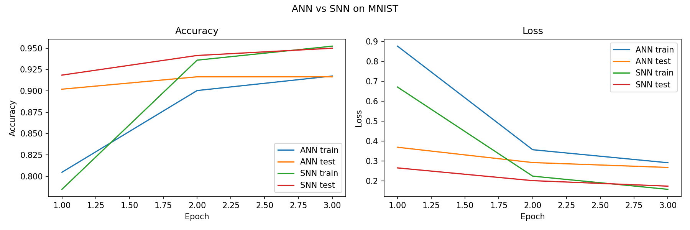 — krzywe accuracy i loss po epokach dla MNIST, tylko dla ANN i SNN.

	Obserwacje: SNN od początku ma wyższy test accuracy niż ANN i utrzymuje przewagę przez trzy epoki, kończąc na 95.0% vs 91.7%. Loss obu modeli spada monotonicznie, a różnica między train i test pozostaje mała, więc w tym krótkim przebiegu nie widać silnego overfittingu.

- 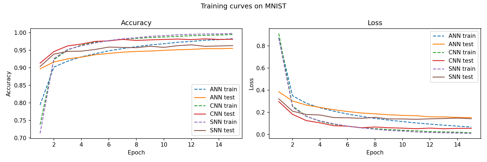 — krzywe accuracy i loss po epokach dla MNIST.

	Obserwacje: CNN dochodzi do najwyższego test accuracy 98.15% i najniższego loss, ale ANN i SNN też szybko stabilizują się powyżej 95%. Po około 8-10 epoce przyrosty są już niewielkie, a odległość między train i test nie sugeruje silnego overfittingu.

- 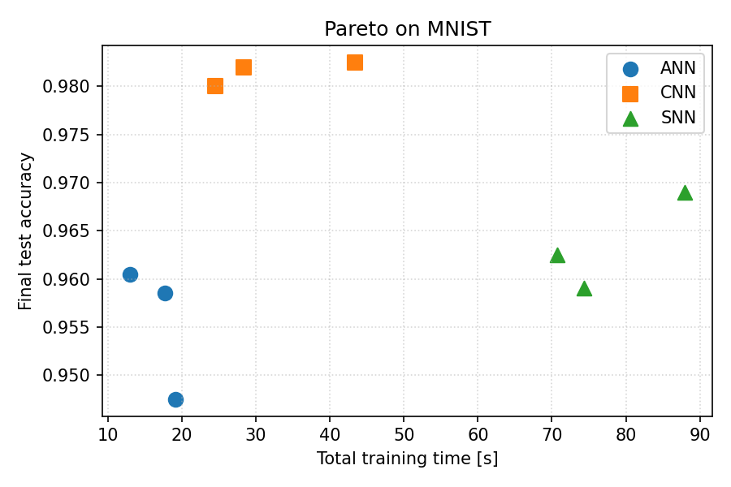 — kompromis czas treningu vs końcowa accuracy.

	Obserwacje: CNN daje najlepszą jakość, ale za cenę około 2x dłuższego treningu niż ANN. SNN ma lepszą accuracy od ANN, lecz jest dużo wolniejszy, więc nie tworzy wyraźnej przewagi Pareto.

-  — macierz pomyłek dla ANN.

	Obserwacje: macierz jest silnie diagonalna, ale najsłabsze klasy to 8, 5 i 9, co zgadza się z ich niższym recall w raporcie klasowym. Błędy są raczej rozproszone niż skupione w jednej parze klas.

-  — macierz pomyłek dla CNN.

	Obserwacje: obraz jest prawie idealnie diagonalny, a jedyny wyraźniejszy spadek jakości dotyczy klas 3 i 9, choć nadal z wysokim recall powyżej 94%. To potwierdza, że CNN rozdziela cyfry MNIST najczyściej.

- 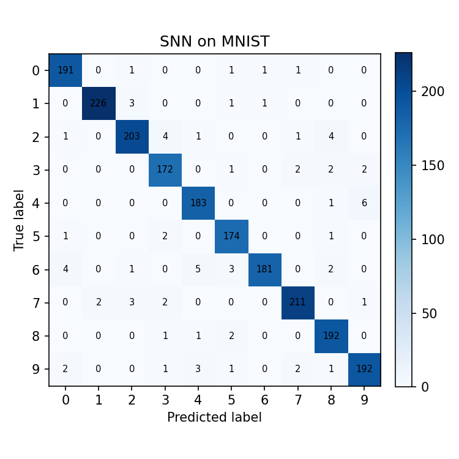 — macierz pomyłek dla SNN.

	Obserwacje: diagonal nadal dominuje, ale błędy są wyraźniejsze niż w CNN, szczególnie dla klas 6, 2 i 9. Mimo tego SNN zachowuje bardzo wysoką jakość na MNIST i tylko nieznacznie odstaje od CNN.

- 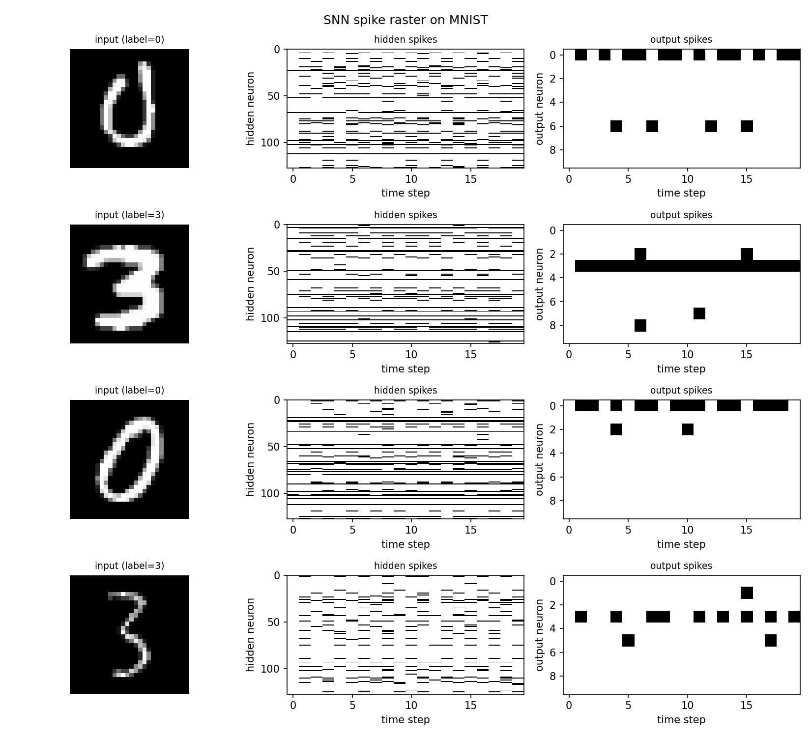 — raster aktywności spików dla SNN.

	Obserwacje: hidden layer jest aktywna w wielu neuronach przez większość timestepów, ale spike'i są krótkie i rozproszone, więc kod pozostaje dość rzadki. Output spikes pojawiają się oszczędnie i skupiają się wokół kilku klas, co odpowiada dobrej, ale nie idealnej separacji.

- 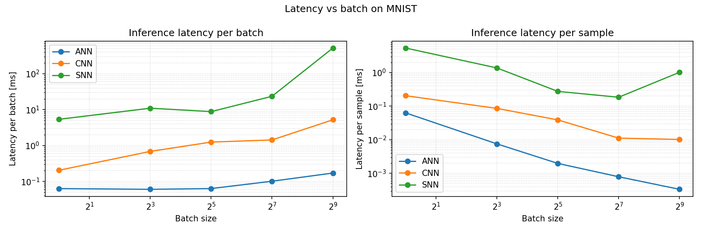 — skalowanie opóźnienia z batch size.

	Obserwacje: ANN ma najniższą latencję dla małych batchy i najlepszą wydajność per sample przy większych batchach. SNN pozostaje najwolniejszy w każdym punkcie, a jego krzywa rośnie zdecydowanie szybciej niż ANN i CNN.

- 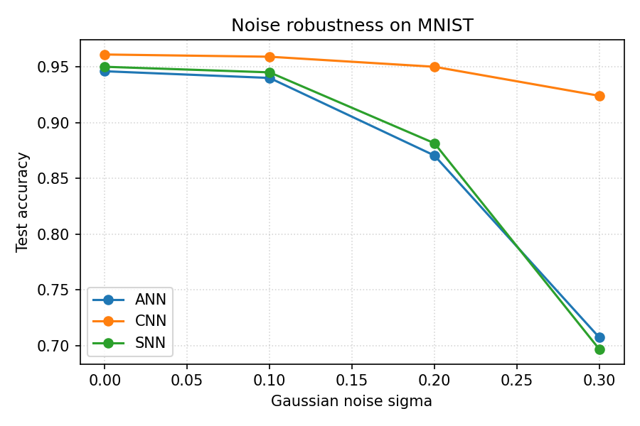 — accuracy vs sigma szumu Gaussa.

	Obserwacje: CNN jest najbardziej odporny, utrzymując 92.4% przy sigma 0.3, gdy ANN i SNN spadają do odpowiednio 70.75% i 69.7%. Przy małym szumie wszystkie modele są blisko siebie, ale przy sigma 0.2 różnica CNN wobec reszty staje się już wyraźna.

- 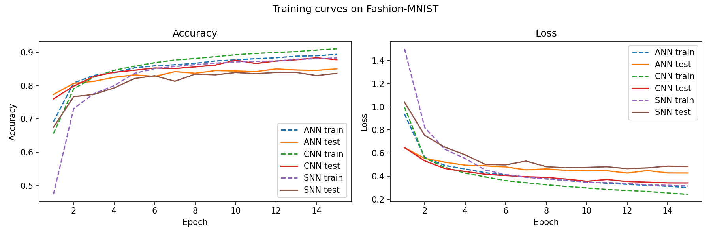 — krzywe accuracy i loss po epokach dla Fashion-MNIST.

	Obserwacje: wszystkie modele poprawiają się wolniej niż na MNIST, a końcowe wartości zatrzymują się niżej, z CNN na czele (87.78%). SNN ma najwyższy loss i największy rozrzut między epokami, więc na tym zbiorze stabilizuje się najsłabiej.

- 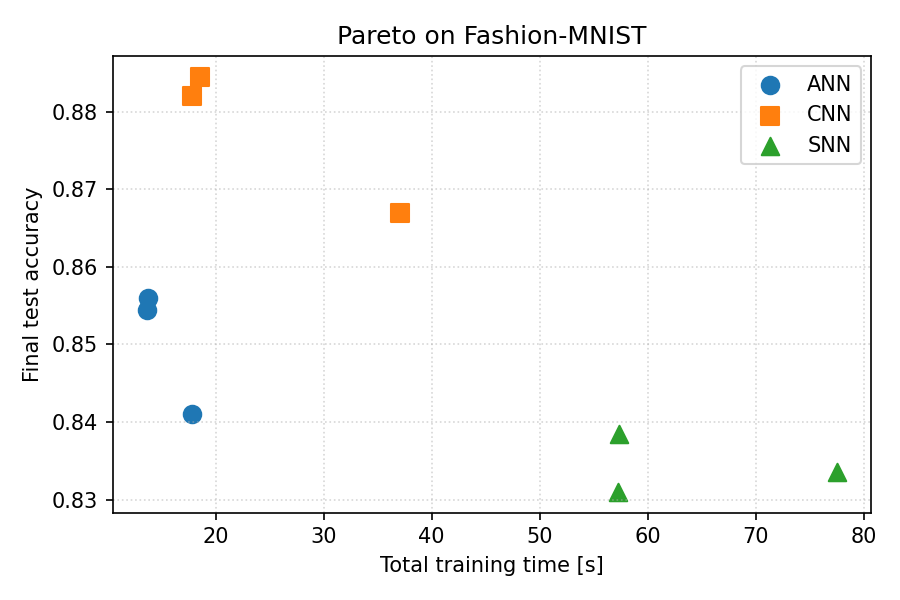 — kompromis czas treningu vs końcowa accuracy.

	Obserwacje: ANN jest najszybszy, CNN najbardziej dokładny, a SNN ląduje pomiędzy nimi bez wyraźnej przewagi. Ponieważ zakres accuracy jest wąski, wykres pokazuje raczej koszt złożoności niż wyraźny punkt dominacji.

- 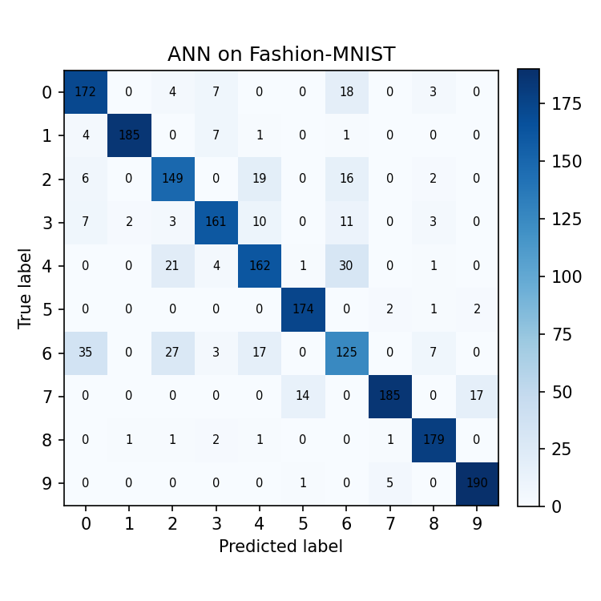 — macierz pomyłek dla ANN.

	Obserwacje: największe problemy dotyczą klas 6, 4 i 2, które mają wyraźnie niższy recall niż reszta. To dobrze pasuje do obrazu Fashion-MNIST, gdzie podobne kształty ubrań łatwo się nakładają.

-  — macierz pomyłek dla CNN.

	Obserwacje: CNN poprawia większość klas, ale nadal słabiej rozpoznaje 4, 6 i 2, więc nie rozwiązuje całkowicie podobieństw między kategoriami odzieży. Diagonal jest jednak wyraźnie mocniejsza niż w ANN i SNN.

- 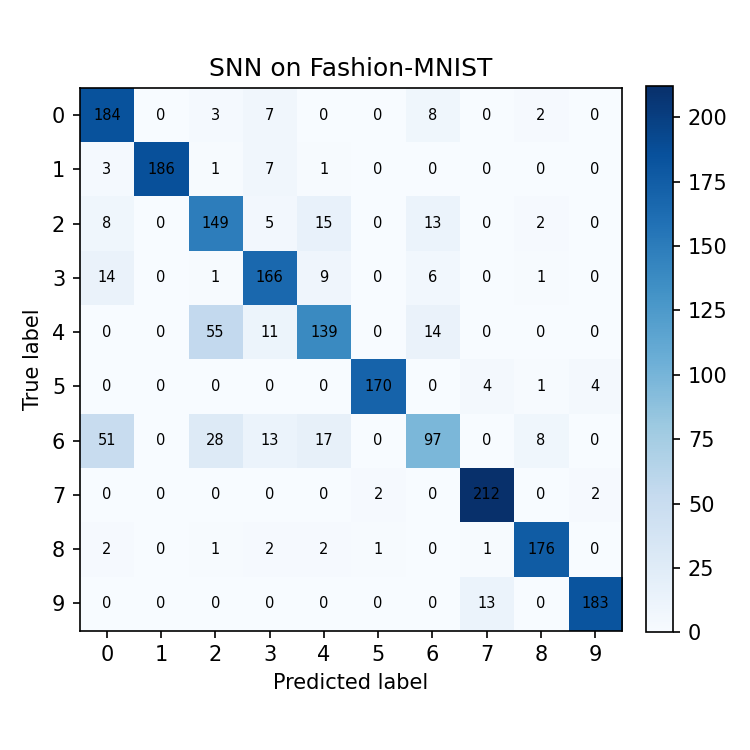 — macierz pomyłek dla SNN.

	Obserwacje: SNN najsilniej gubi klasę 6, a także 4 i 9, co obniża macro-F1 do najniższego poziomu w tej trójce. Błędy są bardziej rozlane niż w CNN, więc przewaga konwolucji jest tu widoczna także na poziomie pomyłek klas.

- 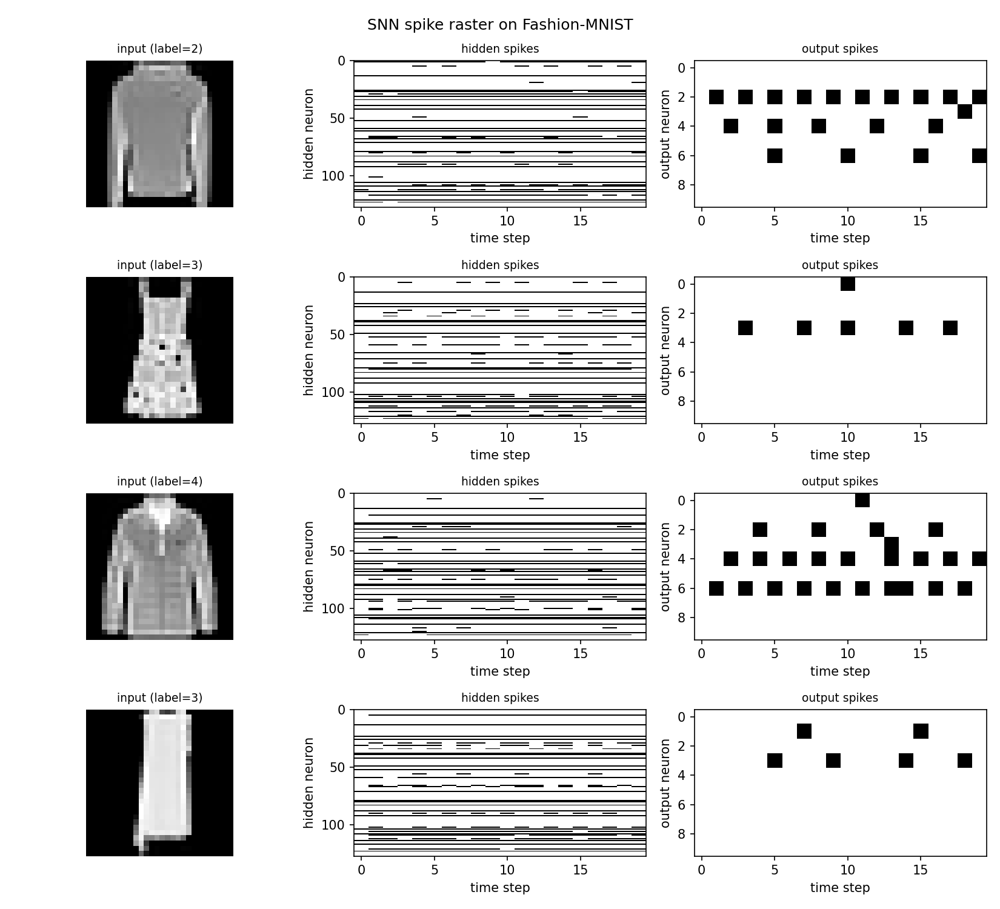 — raster aktywności spików dla SNN.

	Obserwacje: aktywność hidden jest gęstsza i bardziej równomierna niż na MNIST, co pasuje do wyższego hidden spike rate. Output spikes są gęściej rozrzucone po klasach, co sugeruje większą niepewność klasyfikacji.

- 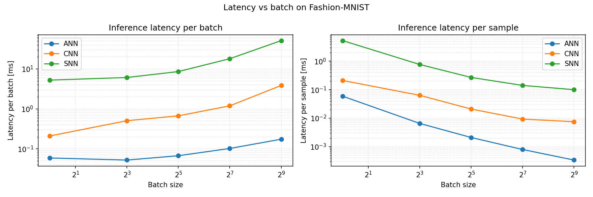 — skalowanie opóźnienia z batch size.

	Obserwacje: ANN zachowuje najniższe opóźnienie na próbkę, a CNN skaluje się sensownie dopiero przy większych batchach. SNN pozostaje wyraźnie wolniejszy i ma większą zmienność przy dużych batchach, więc koszt czasowy nadal dominuje.

- 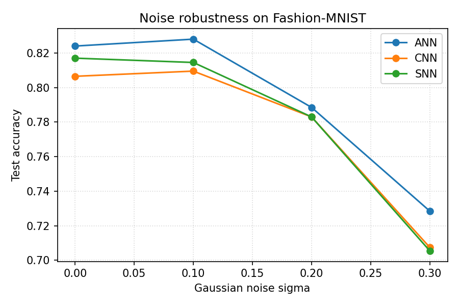 — accuracy vs sigma szumu Gaussa.

	Obserwacje: na tym zbiorze wszystkie trzy modele degradują się podobnie, a różnice między nimi są małe aż do sigma 0.3. ANN lekko prowadzi przy największym szumie, ale nie ma tu efektu takiej przewagi CNN jak na MNIST.

- 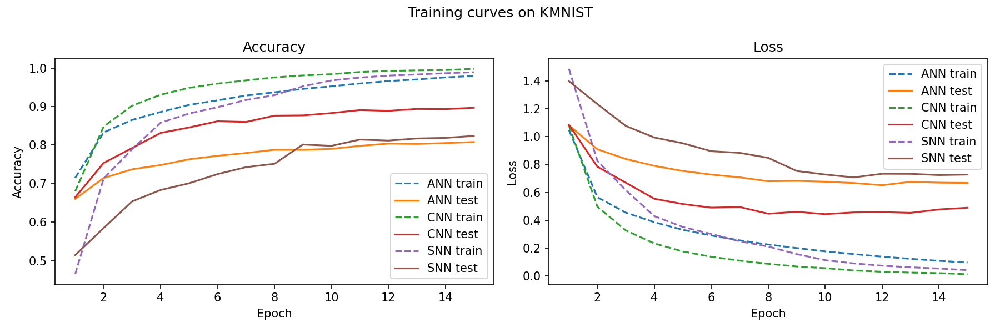 — krzywe accuracy i loss po epokach dla KMNIST.

	Obserwacje: CNN od początku utrzymuje wyraźną przewagę i kończy na 89.68% accuracy, podczas gdy ANN i SNN zatrzymują się odpowiednio na 80.80% i 82.43%. SNN poprawia się szybko na starcie, ale po kilku epokach wyraźnie się wypłaszcza.

- 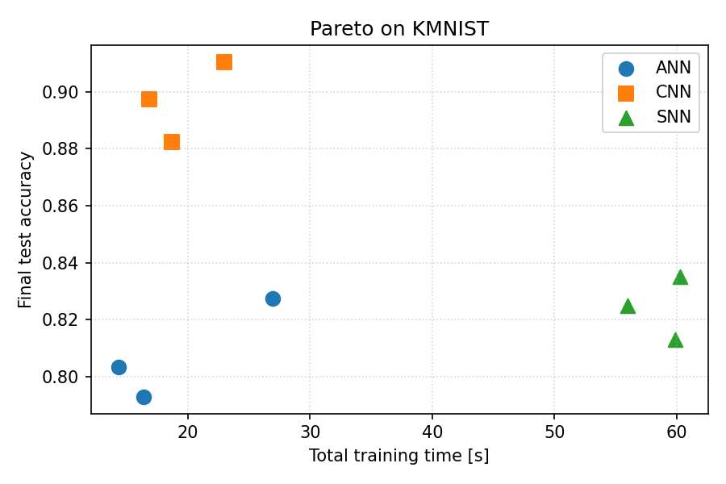 — kompromis czas treningu vs końcowa accuracy.

	Obserwacje: CNN jest tu najlepszym punktem, bo daje najwyższą accuracy przy czasie zbliżonym do ANN. SNN jest jednocześnie wolniejszy i słabszy od CNN, więc leży poza sensowną granicą Pareto.

- 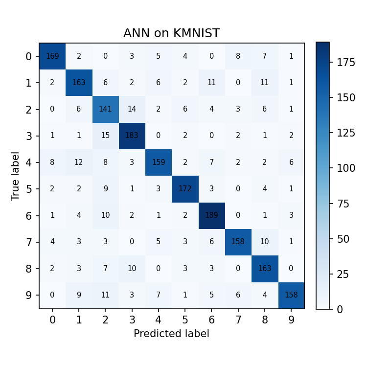 — macierz pomyłek dla ANN.

	Obserwacje: największe braki widać dla klas 6, 2, 7 i 9, czyli tam, gdzie litery znaków są najbardziej podobne. To tłumaczy niższy macro recall w porównaniu z MNIST.

- 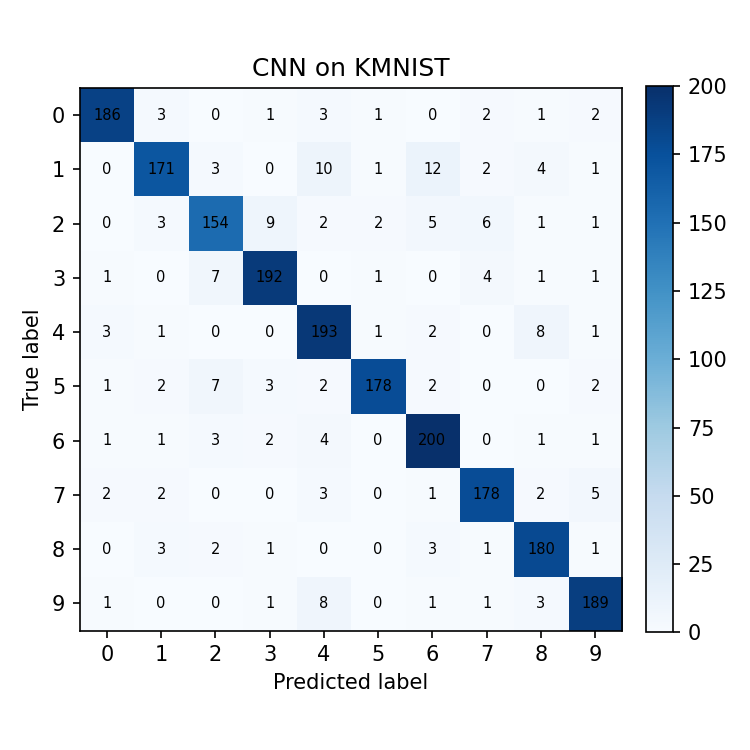 — macierz pomyłek dla CNN.

	Obserwacje: CNN znacząco poprawia separację, ale nadal ma słabsze klasy 2, 4, 7 i 9 niż reszta. Diagonal jest jednak wyraźnie mocniejsza, więc obraz jest spójny z najwyższą accuracy.

- 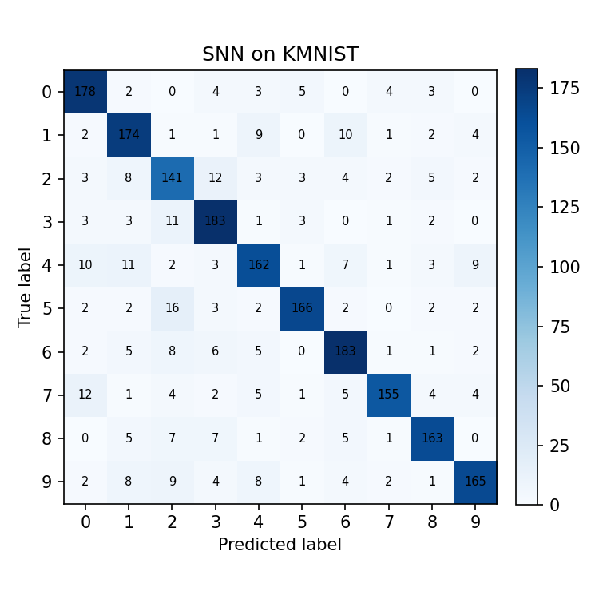 — macierz pomyłek dla SNN.

	Obserwacje: SNN najwięcej traci na klasach 8, 5, 9 i 7, a szczególnie niski recall klasy 8 pokazuje słabszą reprezentację bardziej złożonych wzorów. W praktyce macierz jest wyraźnie mniej czysta niż w CNN.

- 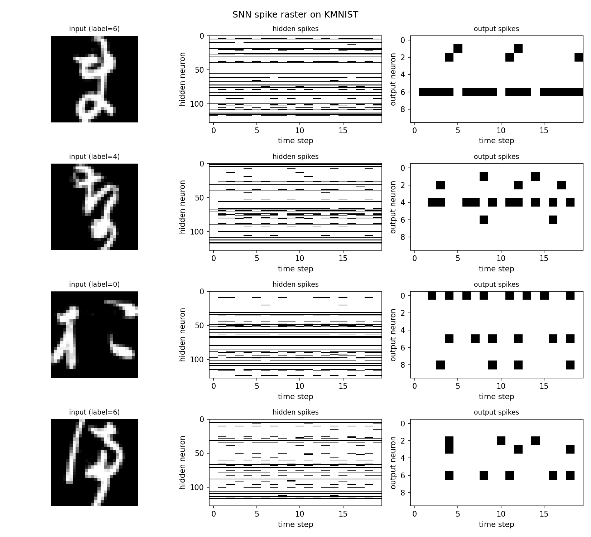 — raster aktywności spików dla SNN.

	Obserwacje: hidden spikes są bardziej rozciągnięte w czasie, ale średnio rzadsze niż na MNIST i Fashion-MNIST. Output spikes skupiają się na pojedynczych klasach przez większość timestepów, co pasuje do umiarkowanej, ale nie dominującej separacji.

- 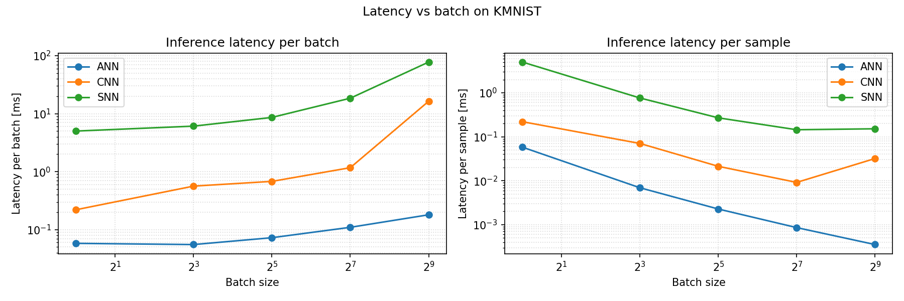 — skalowanie opóźnienia z batch size.

	Obserwacje: ANN i CNN utrzymują niskie opóźnienia jednostkowe przy większych batchach, podczas gdy SNN rośnie najtrudniej do zrównoleglenia. Wykres pokazuje, że batch size poprawia throughput, ale nie likwiduje przewagi czasowej prostszych modeli.

- 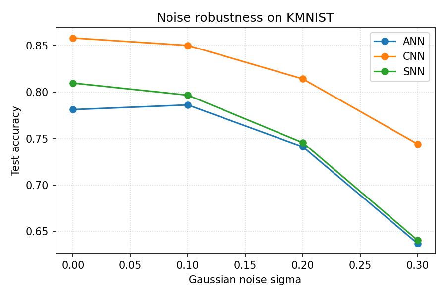 — accuracy vs sigma szumu Gaussa.

	Obserwacje: CNN zachowuje najlepszą odporność na szum we wszystkich punktach, a przy sigma 0.3 nadal ma 74.4% accuracy. ANN i SNN spadają mocniej i bardzo zbliżają się do siebie na wyższych poziomach szumu.

- 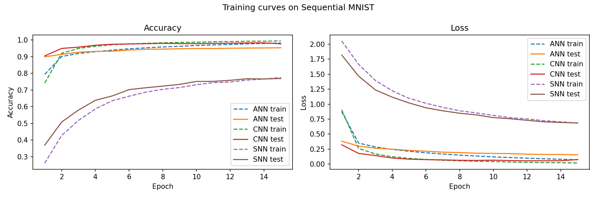 — krzywe accuracy i loss po epokach dla Sequential MNIST.

	Obserwacje: ANN i CNN szybko dochodzą do wysokich wyników, ale SNN pozostaje wyraźnie w tyle i kończy na 76.92% accuracy. Rozjazd lossów między SNN a dwoma klasycznymi modelami utrzymuje się przez cały trening, więc problem nie znika z epoką.

- 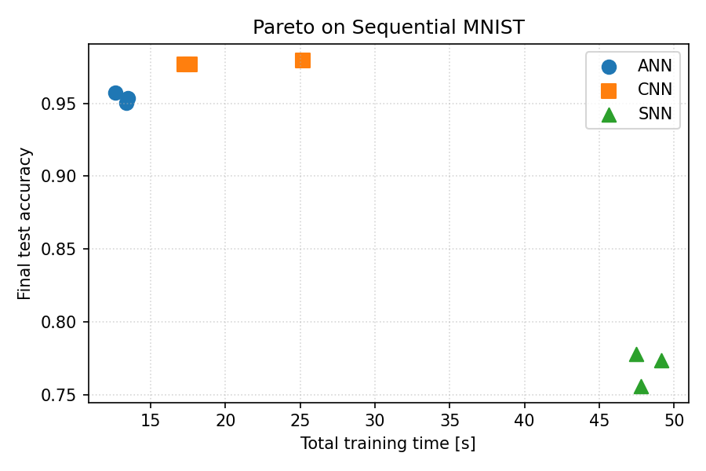 — kompromis czas treningu vs końcowa accuracy.

	Obserwacje: ANN i CNN tworzą tu sensowny kompromis między czasem i jakością, a SNN jest jednocześnie wolniejszy i dużo mniej dokładny. To sprawia, że SNN jest tutaj najsłabszym punktem na wykresie Pareto.

- 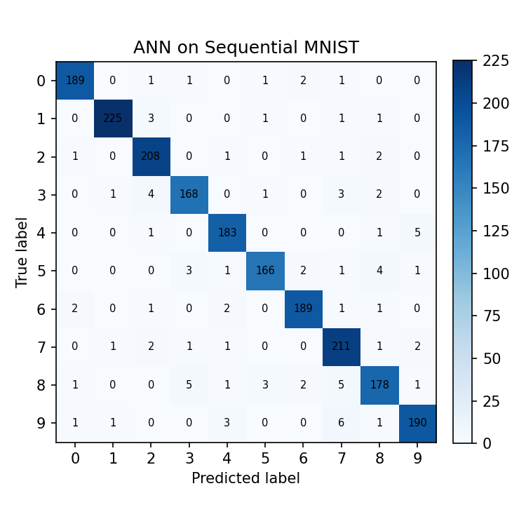 — macierz pomyłek dla ANN.

	Obserwacje: macierz jest nadal mocno diagonalna, ale najsłabiej wypadają klasy 1, 2, 4 i 5, czyli te o większym podobieństwie kształtów. Mimo to ANN utrzymuje bardzo dobrą jakość na poziomie około 95%.

-  — macierz pomyłek dla CNN.

	Obserwacje: CNN ma prawie idealną diagonalę i tylko drobne pomyłki w klasach 3, 5 i 8. To odpowiada najwyższej accuracy i pokazuje, że model dobrze wykorzystuje informację sekwencyjną.

- 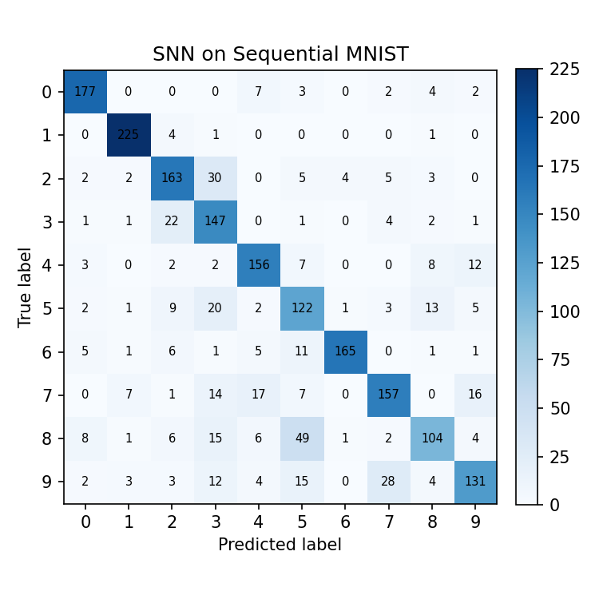 — macierz pomyłek dla SNN.

	Obserwacje: SNN myli znacznie więcej klas, szczególnie 2, 5, 7, 8 i 9, co zgadza się z niskim recall tych kategorii. Wykres jest dużo mniej skoncentrowany na przekątnej niż w ANN i CNN, więc błąd nie jest lokalny, tylko systemowy.

- 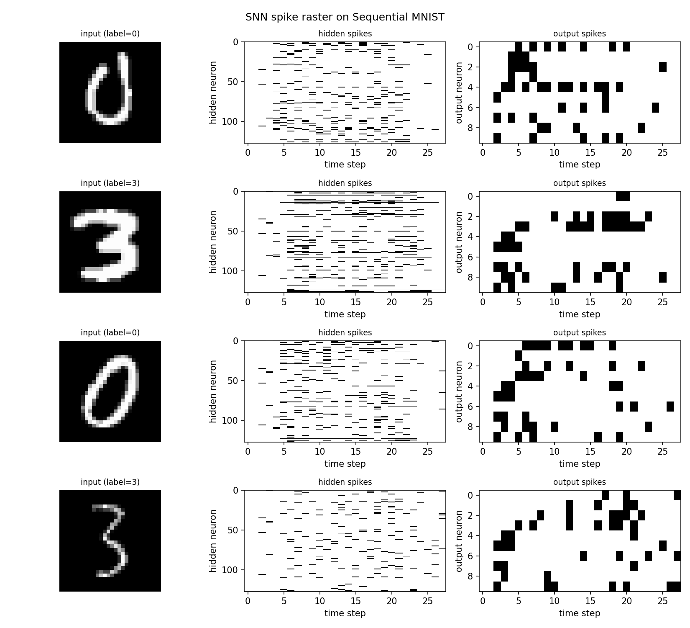 — raster aktywności spików dla SNN.

	Obserwacje: hidden activity jest wyraźnie rzadsza i bardziej przesunięta do późniejszych timestepów niż w rate-coded MNIST. Output spikes są rozproszone po wielu klasach, co wizualnie pasuje do słabszej separacji i najniższego spike rate.

- 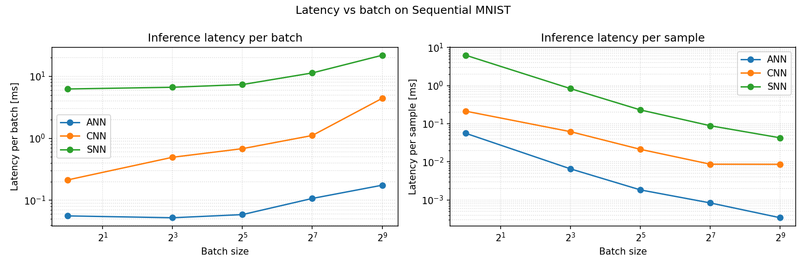 — skalowanie opóźnienia z batch size.

	Obserwacje: ANN pozostaje najszybszy, CNN jest wyraźnie droższy, ale nadal dużo szybszy od SNN. Dla SNN sama zmiana batch size nie usuwa kosztu pętli czasowej, więc wykres pokazuje głównie przesunięcie ciężaru pracy, a nie realne odwrócenie hierarchii modeli.

- 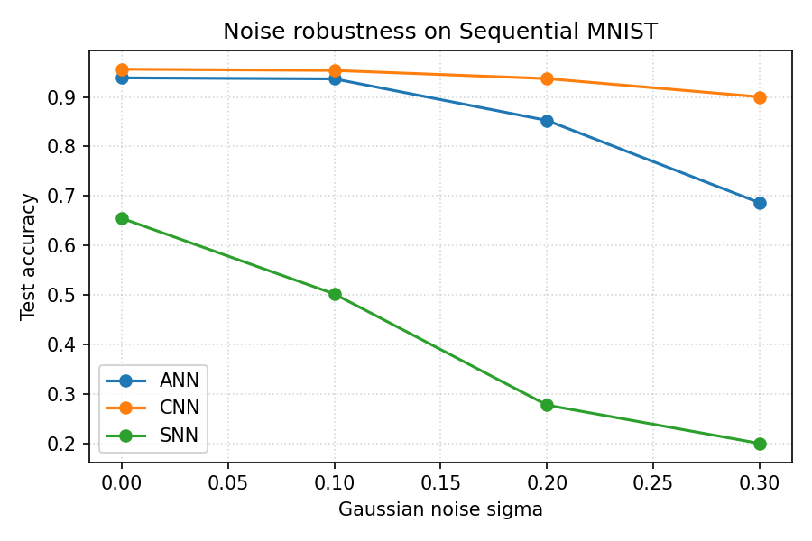 — accuracy vs sigma szumu Gaussa.

	Obserwacje: CNN pozostaje stabilny nawet przy sigma 0.3 i kończy na 90.0%, podczas gdy ANN spada do 68.6%. SNN jest najbardziej wrażliwy, bo po niewielkim szumie jego accuracy gwałtownie się załamuje i przy sigma 0.3 dochodzi tylko do 20.0%.
